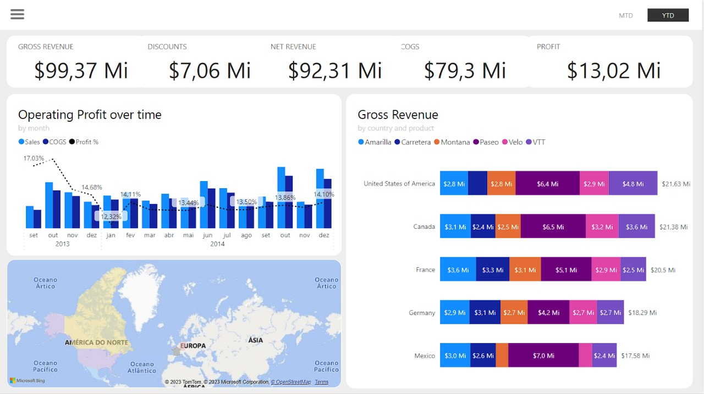

<a name="readme-top"></a>
<div align="center">
  
  [![Contributors][contributors-shield]][contributors-url]
  [![Forks][forks-shield]][forks-url]
  [![Stargazers][stars-shield]][stars-url]
  [![Issues][issues-shield]][issues-url]
  [![MIT License][license-shield]][license-url]
  [![LinkedIn][linkedin-shield]][linkedin-url]

</div>
<br />
<div align="center">
  <a href="https://github.com/voaneves/financial_sample_analysis">
    
  </a>
  <h3 align="center">financial_sample_analysis</h3>
  <p align="center">
    A complete financial analysis on PowerBI.
    <br />
    <a href="https://github.com/voaneves/financial_sample_analysis"><strong>Explore the documentation »</strong></a>
    <br />
    <br />
    <a href="https://github.com/voaneves/financial_sample_analysis/issues">Report a Bug</a>
    ·
    <a href="https://github.com/voaneves/financial_sample_analysis/issues">Request a Feature</a>
  </p>
</div>

<details>
  <summary>Table of Contents</summary>
  <ol>
    <li>
      <a href="#about-the-project">About the Project</a>
      <ul>
        <li><a href="#technologies-used">Technologies Used</a></li>
      </ul>
    </li>
    <li><a href="#project-structure">Features</a></li>
    <li><a href="#methodology">Features</a></li>
    <li><a href="#challenges-and-solutions">Features</a></li>
    <li><a href="#results">Features</a></li>
    <li><a href="#getting-started">Getting started</a></li>
    <li><a href="#to-do">To Do</a></li>
    <li><a href="#reporting-bugs">Reporting Bugs</a></li>
    <li><a href="#license">License</a></li>
  </ol>
</details>

## About the project

<p align="center">
  <a href="https://voaneves.com/financial_sample_analysis">
    
  </a>
</p>

This repository contains a thorough financial analysis of the sample made available by Microsoft, using Power BI.

The challenge is to create a more elaborate report based on the Power BI financial samples. The data files are available on the [financial_samples.xlsx](https://github.com/voaneves/financial_sample_analysis/blob/main/Criando%20um%20Relat%C3%B3rio%20de%20Vendas%20Elegante%20com%20Power%20BI/Financial%20Sample.xlsx).

Key points to pay attention to:
- Defined structure
- Navigation buttons that provide navigability
- Used slicers and associated image buttons
- Use indicators and buttons to select different visuals on the same subject

<p align="right">(<a href="#readme-top">back to top</a>)</p>

### Technologies Used

The project uses the following technologies:

- Excel: Open base made available by Microsoft on the Power BI website.
- PowerBI Desktop (unfortunately, online publishing and sharing is only for PRO users)

<p align="right">(<a href="#readme-top">back to top</a>)</p>

## Project Structure

- Folder 1: Creating an Elegant Sales Report with Power BI
  - Financial Sample Analysis @voaneves.pbix
  - Financial Sample.xlsx
- LICENSE
- README.md

## Methodology

### Data Preparation

Data Import: The data was imported into Power BI from an open dataset provided by Microsoft on the official Power BI website.

### Initial Setup

1. Metric Definition: Metrics such as Gross Revenue, Discounts, Net Revenue, COGS, and Profit were defined for analysis.
2. Slicer Configuration: Added slicers for MTD (Month-to-Date) and YTD (Year-to-Date) to allow for more precise time-based analysis.

### Development of the First Page (Overview)

3. Grouped Columns and Line Chart: A chart showing operating profit over time was created, grouped by month.
4. Stacked Bar Chart: This chart was used to display gross revenue by product and country.
5. Revenue Map: A map was implemented to visualize the distribution of revenue among different countries.

### Development of the Second Page (Profit Analysis)

6. Hierarchical Tree: Used for a detailed analysis of profit by category.
7. Radar Chart: Implemented to show total profit by product.
8. Treemap: Used to visualize the percentage of profit by country.
9. Funnel: Created to display the percentage of profit by discount band.
10. Stacked Bar Charts: Used to show the percentage of profit by segment.

### Publication and Sharing

11. Final Verification: Before publishing, all visuals were checked to ensure data accuracy.
12. Publication on Power BI Service: The report was then published on Power BI Service for easier access and sharing.

## Challenges and Solutions

### Challenge 1: Temporal Data Aggregation

- Problem: During the creation of the "Operating profit over time by month" chart, we faced difficulties in the correct aggregation of temporal data.
- Solution: We used advanced DAX functions to create a date table that aided in the precise aggregation of data by month.

### Challenge 2: Geographic Visualization

- Problem: The map initially was not displaying the distribution of revenue among countries clearly.
- Solution: Adjustments were made in the map settings and input data to improve clarity and accuracy of the visualization.

### Challenge 3: Performance

- Problem: The report was slow to load, especially the hierarchical tree on the "Profit Analysis" page.
- Solution: We optimized queries and used data modeling techniques to improve report performance.

### Challenge 4: Visualization Consistency

- Problem: Maintaining a consistent appearance between different types of charts and report pages.
- Solution: We established a set of style guidelines and applied them consistently across all visualizations.

### Challenge 5: Report Publication

- Problem: Initial difficulties in publishing the report on Power BI Service, including compatibility and authentication issues.
- Solution: We updated to the latest version of Power BI Desktop and followed troubleshooting procedures to resolve authentication issues.

## Results

1. The report revealed that the operating profit is higher in Channel Partners, both YTD and MTD.
2. The analysis by product and country indicated that Paseo is the most popular product in all countries where sales occur.

### Profit Analysis

1. The hierarchical tree chart showed that France significantly contributes to the overall profit, suggesting that more investments could be directed to this area.
2. The radar chart showed that the Paseo product performs well on multiple indicators, making it an ideal candidate for promotions or market expansion.

### Geographic Analysis

1. The revenue distribution map showed that North America is the largest contributor to revenue, while markets in Europe are still underexplored.

### Efficiency and Usability

1. The report was optimized for quick loading, making it efficient and more user-friendly.
2. The MTD and YTD slicers allow for easy and effective temporal analysis, offering users the flexibility to customize their views.

## Attachments

- [PowerBI Service](https://app.powerbi.com/groups/me/reports/c0543c7a-d391-4474-9fa8-99966ef98170/ReportSection?experience=power-bi)
- [GitHub PBIX File](https://github.com/voaneves/financial_sample_analysis/blob/main/Criando%20um%20Relat%C3%B3rio%20de%20Vendas%20Elegante%20com%20Power%20BI/Financial%20Sample%20Analysis%20%40voaneves.pbix)

<p align="right">(<a href="#readme-top">back to top</a>)</p>

## Getting started

1. Clone this repository to your machine:

   ```bash
   git clone https://github.com/your-username/financial_sample_analysis.git

   ```

2. Open the index.html file in a web browser.

3. Use the mouse to select colors while moving it.

4. If you click on the selected color, a sliding notification will appear and show which color you selected and copy it to the clipboard.

<p align="right">(<a href="#readme-top">back to top</a>)</p>

## To do

- [ ] Add more pages;
- [ ] Better design the report structure and make the "toggle button" more functional.

<p align="right">(<a href="#readme-top">back to top</a>)</p>

## Reporting bugs

Found a bug or issue in the project? Follow the steps below:

1. Check if the bug has already been reported in our "Issues" section on GitHub: link to Issues.

2. If you don't find an existing report about the bug, click on "New Issue" to open a new bug report.

3. Provide a clear and descriptive title for the bug, along with a detailed description of the steps needed to reproduce it.

4. If possible, include screenshots, relevant code snippets, or any other information that may help identify and resolve the bug.

5. Click on "Submit Issue" to create the bug report.

Thank you for reporting bugs! If you would like to contribute with code, you can open a PR, and your participation is more than welcome.

<p align="right">(<a href="#readme-top">back to top</a>)</p>

## License

This project is licensed under the [MIT License](/LICENSE).

<p align="right">(<a href="#readme-top">back to top</a>)</p>

[contributors-shield]: https://img.shields.io/github/contributors/voaneves/financial_sample_analysis.svg?style=for-the-badge
[contributors-url]: https://github.com/voaneves/financial_sample_analysis/graphs/contributors
[forks-shield]: https://img.shields.io/github/forks/voaneves/financial_sample_analysis.svg?style=for-the-badge
[forks-url]: https://github.com/voaneves/financial_sample_analysis/network/members
[stars-shield]: https://img.shields.io/github/stars/voaneves/financial_sample_analysis.svg?style=for-the-badge
[stars-url]: https://github.com/voaneves.com/financial_sample_analysis/stargazers
[issues-shield]: https://img.shields.io/github/issues/voaneves/financial_sample_analysis.svg?style=for-the-badge
[issues-url]: https://github.com/voaneves/financial_sample_analysis/issues
[license-shield]: https://img.shields.io/github/license/voaneves/financial_sample_analysis.svg?style=for-the-badge
[license-url]: https://github.com/voaneves/financial_sample_analysis/blob/main/LICENSE
[linkedin-shield]: https://img.shields.io/badge/-LinkedIn-black.svg?style=for-the-badge&logo=linkedin&colorB=555
[linkedin-url]: https://linkedin.com/in/voaneves
[financial_sample_analysis-logo]: img/financial_sample_analysis-logo.png
